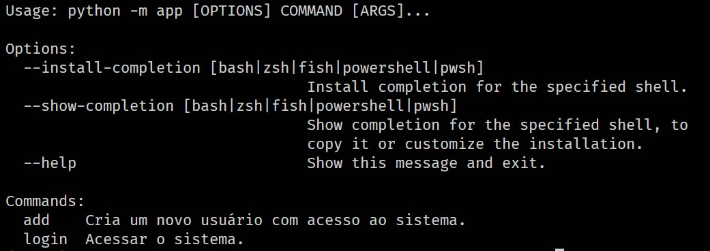

<p align="center">
  <a href="#-tecnologias">Tecnologias</a>&nbsp;&nbsp;&nbsp;|&nbsp;&nbsp;&nbsp;
  <a href="#-projeto">Projeto</a>&nbsp;&nbsp;&nbsp;|&nbsp;&nbsp;&nbsp;
  <a href="#-como-executar">Como executar</a>
</p>


<hr>

<a id="-tecnologias"></a>

## Tecnologias

Esse projeto foi desenvolvido com a seguinte tecnologia:


<hr>

<a id="-projeto"></a>

## 💻 Projeto

O projeto Login é uma aplicação de linha de comando, que tem como propósito expor uma maneira simples e agradável de se lidar com aplicações de cli.

<p align="center">
  
</p>

<a id="-como-executar"></a>

## 🚀 Como executar

### 💻 Pré-requisitos
 **Antes de começar, verifique se você atendeu aos seguintes requisitos:**

- Você tem uma máquina `< Windows / Linux / Mac >`.

- Você tem python na versão 3.11 ou superior instalado em sua máquina.


### Como instalar localmente:

- clone ou baixe o repositório.

- Acesse a pasta do projeto no terminal execute:

```console
pip install --upgrade pip
pip install --upgrade poetry
poetry config virtualenvs.in-project true
poetry install
poetry shell
```

## 👨‍💻 Utilizando a aplicação (localmente)
Para executar a aplicação(Com o ambiente virtual ativo):

- Acesse a pasta do projeto no terminal execute:

```console
python -m app --help
```

### Dessa forma é possível ver os comandos do sistema, os comandos devem vir após o uso de "python -m app".